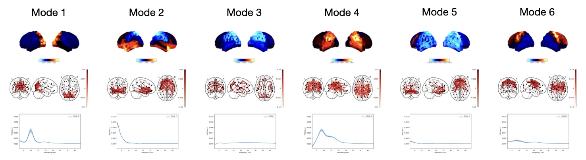

# TDE-DyNeMo Network Analysis

To learn about DyNeMo, see the osl-dynamics [docs](https://osl-dynamics.readthedocs.io/en/latest/models/dynemo.html).

## To run

```
python run.py 6 1
```
where `8` is the number of modes and `1` is the run ID.

This script expects the training data to be in a directory called `data/npy`, which contains `.npy` files with the parcel time courses. The data should be in (time, parcels) format.

This will create a directory called `results/6_modes/run01` which will contain the output.

## Pipeline

In this example we do the following:

- Load the parcel data.
- Prepare the data by performing time-delay embedding, PCA and standardisation.
- Train DyNeMo.
- Calculate subject and mode-specific spectra using a GLM.
- Plot networks.
- Calculate and plot summary statistics for dynamics.

Note, there is a variable called `n_jobs` in these scripts that should be set to the number of cores you would like to use.

## Results

If you train DyNeMo on the CTF data source reconstucted in the MEGUK example (see `/ctf_preproc`). You should expect to get something similar to the following results:


