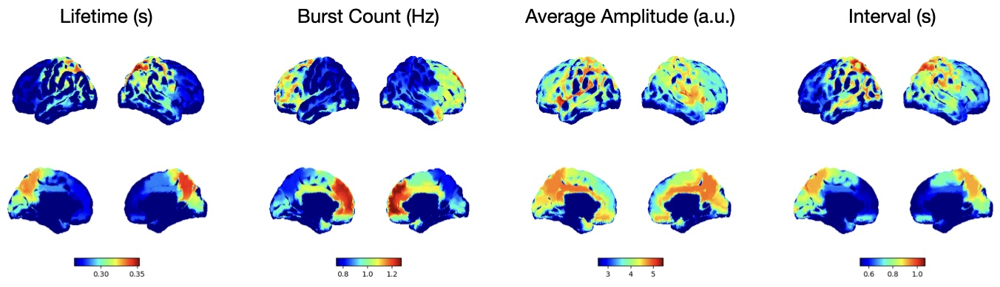

# TDE-HMM Single Channel Burst Analysis

To learn about the HMM, see the osl-dynamics [docs](https://osl-dynamics.readthedocs.io/en/latest/models/hmm.html).

## To run

```
python run.py 3 0 1
```
where `3` is the number of states, `0` is the channel index, and `1` is the run ID.

This script expects the training data to be in a directory called `data/npy`, which contains `.npy` files with the parcel time courses. The data should be in (time, parcels) format.

This will create a directory called `results/3_states/channel000/run01` which will contain the output.

If you would like to train an HMM for multiple channels in serial you can use:
```
python run_all.py
```

## Pipeline

In this example we do the following:

- Load a single channel from the parcel data.
- Downsample the data to 100 Hz.
- Prepare the data by performing time-delay embedding and standardisation.
- Train an HMM.
- Calculate subject and state-specific multitaper spectra for the channel.
- Calculate and plot summary statistics for the bursts.

## Results

If you run the burst analysis on the CTF data source reconstucted in the MEGUK example (see `/ctf_preproc`). You should expect to get something similar to the following results:



The above plots were generated with `plot_summary_stats.py`. They are the burst summary statistics for the HMM state with the highest amount of beta power.
