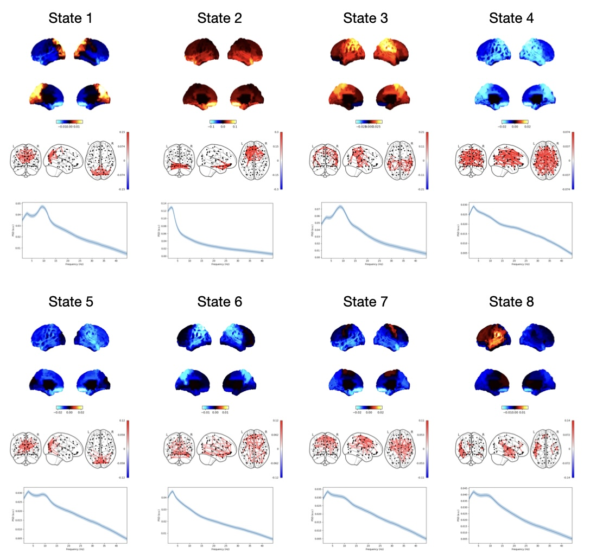

# TDE-HMM Network Analysis

To learn about the HMM, see the osl-dynamics [docs](https://osl-dynamics.readthedocs.io/en/latest/models/hmm.html).

## To run

```
python run.py 8 1
```
where `8` is the number of states and `1` is the run ID.

This script expects the training data to be in a directory called `data/npy`, which contains `.npy` files with the parcel time courses. The data should be in (time, parcels) format.

This will create a directory called `results/8_states/run01` which will contain the output.

## Pipeline

In this example we use the simplified 'config API' interface where we specify everything use a config. We do the following:

- Load the parcel data.
- Prepare the data by performing time-delay embedding, PCA and standardisation.
- Train an HMM.
- Calculate subject and state-specific multitaper spectra.
- Plot networks.
- Calculate and plot summary statistics for dynamics.

Note, there is a variable called `n_jobs` in these scripts that should be set to the number of cores you would like to use.

## Results

If you train the HMM on the CTF data source reconstucted in the MEGUK example (see `/ctf_preproc`). You should expect to get something similar to the following results:


